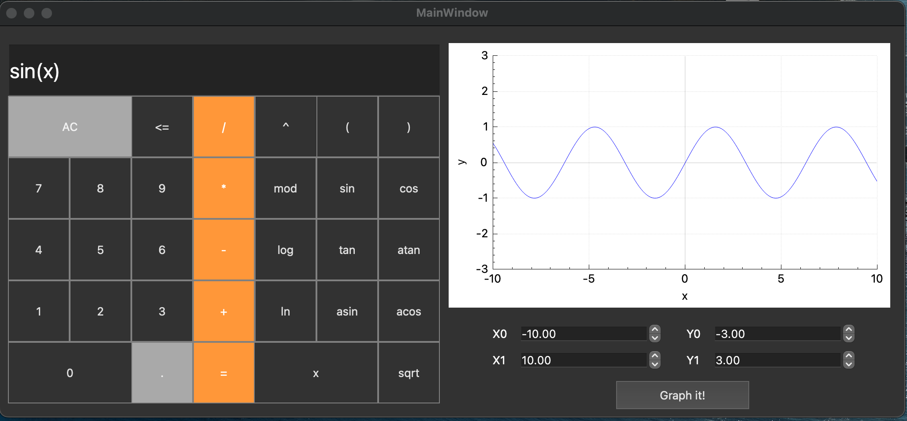

# SmartCalc_C
Implementation of an extended version of the standard calculator with graph plotting capabilities using the C programming language



## Installation
To use this calculator, the user needs to install the following utilities:
- `gcc`
- `make`
- `qmake`

## Development Details
The calculator has been developed using the C/C++ programming language and the QT Creator version 6.2.

This project is implemented using Dijkstra's algorithm.. Edsger Dijkstra invented an algorithm for converting expressions (including functions) from infix to Reverse Polish notation. The algorithm was named the "shunting-yard algorithm".

The Shunting-yard algorithm is stack-based. There are two text variables involved in the conversion: the input and the output string. The conversion process uses the stack to store operations not yet added to the output string. The conversion program sequentially reads each token from the input string and on each step does some actions based on which tokens have been read.

## Installation Command
To install the calculator, please run the following command:
```
make install
```

## Arithmetic Operations
The calculator supports the following arithmetic operations:

| Operator name | Infix notation <br /> (Classic) | Prefix notation <br /> (Polish notation) | Postfix notation <br /> (Reverse Polish notation) |
| --------- | ------ | ------ | ------ |
| Brackets | (a + b) | (+ a b) | a b + |
| Addition | a + b | + a b | a b + |
| Subtraction | a - b | - a b | a b - |
| Multiplication | a * b | * a b | a b * |
| Division | a / b | / a b | a b \ |
| Power | a ^ b | ^ a b | a b ^ |
| Modulus | a mod b | mod a b | a b mod |
| Unary plus | +a | +a | a+ |
| Unary minus | -a | -a | a- |


## Mathematical Functions
The calculator includes various mathematical functions, including:
  
| Function description | Function |
| -------------------- | -------- |
| Computes cosine    | cos(x)  |
| Computes sine      | sin(x)  |
| Computes tangent   | tan(x)  |
| Computes arc cosine | acos(x) |
| Computes arc sine  | asin(x) |
| Computes arc tangent| atan(x) |
| Computes square root| sqrt(x) |
| Computes natural logarithm| ln(x)|
| Computes common logarithm| log(x)|


## Function Plotting
The calculator provides the ability to plot functions. Plotting a graph of a function given by an expression in infix notation with the variable _x_ (with coordinate axes, mark of the used scale and an adaptive grid)
You can visualize mathematical equations easily.